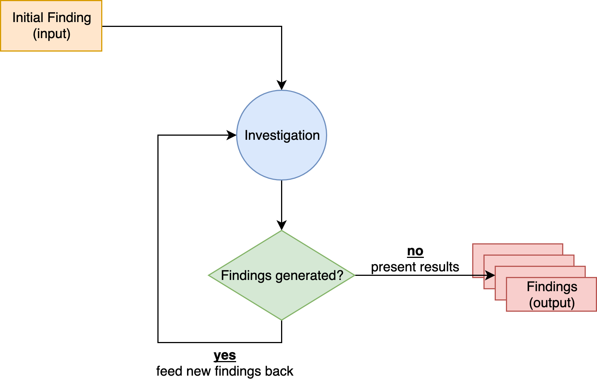

# gumshoe

Recursive OSINT investigation tool - a [TraceLabs](https://tracelabs.org) backed project

The idea is that the tool is fed an initial (set of) finding(s). These findings will be used to come up with more findings, which will in turn be used to come up with even more findings in a recursive manner... until no findings are generated.

### Some Concepts

- Investigation: the "current" ongoing investivation
- Finding: any data that is either fed into or produced by the investigation. These are many distinct kinds of finding types:
	- Persnally Identifiable Information:
		- email
		- phone number
		- home address
	- Digital Aliases:
		- usernames
		- social media accounts
		- images (reverse image search)
	- Geolocation: 
		- physical coordinates of an event
	- Info:
		- school attended
		- family members
		- friends

### Proposed Design:

