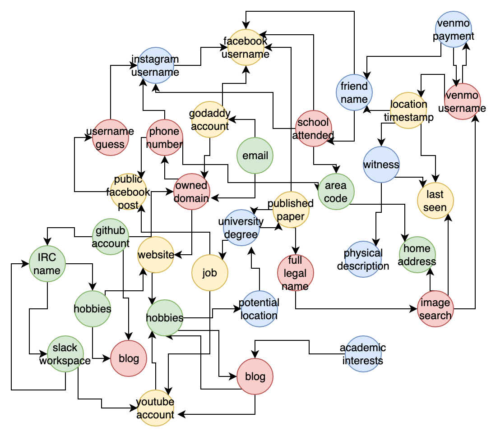

# gumshoe [Proof of Concept - In Progress]

[](https://goreportcard.com/report/github.com/tracelabs/gumshoe)
[](https://github.com/tracelabs/gumshoe/issues)
[](https://godoc.org/github.com/tracelabs/gumshoe)
[](https://github.com/tracelabs/gumshoe/blob/master/LICENSE)

Recursive OSINT investigation tool based on the [OSINT Framework](https://osintframework.com/).

> This project is a [TraceLabs](https://tracelabs.org) initiative
 
### Proposed Design:

The idea is that the tool is fed an initial (set of) finding(s). These findings will be used to come up with more findings, which will in turn be used to come up with even more findings in a recursive manner... until no new findings are generated -- duplicates are ignored.


##### Key Concepts

- Investigation: the "current" ongoing investigation
- Finding: any data that is either fed into or produced by the investigation. There may be an infinity of distinct Finding types/implementations, but they all must satisfy the following interface:

```
type Finding interface {
	// Use finding data to come up with more findings.
	// A good measure of the usefulness of a finding
	// is how many findings are produced by this method.
	Investigate() []Finding

	// Get the name of the struct that implements the 
	// Finding interface.
	GetTypeName() string

	// Get the ID of the finding. The ID can be any string
	// that is equivalent for two equal findings of the 
	// same underlying struct (and different otherwise).
	GetID() string
	
	// Pretty-print the finding's useful data to stdout.
	Display()
}
```

### Vision:


- Ultimately, the [findings](https://github.com/tracelabs/gumshoe/tree/master/findings) package will contain a vast amount of implementations
- These implementations will be interconnected in a directed graph by nature -- resembling the shape of how OSINT data is found in the web



- The end user of this tool should be able to "enter" this graph of data by providing one or more finding(s) to the Run(...) function in investigation.go
 
```
// Run begins the investigation with the initial finding(s) provided
func Run(fs ...finding.Finding) []finding.Finding {...}
```
- The tool should be able to display the investigation's resultant findings in a way which highlights their relevance
- The goal here is essentially to automate the [OSINT Framework](https://osintframework.com/) as much as possible


